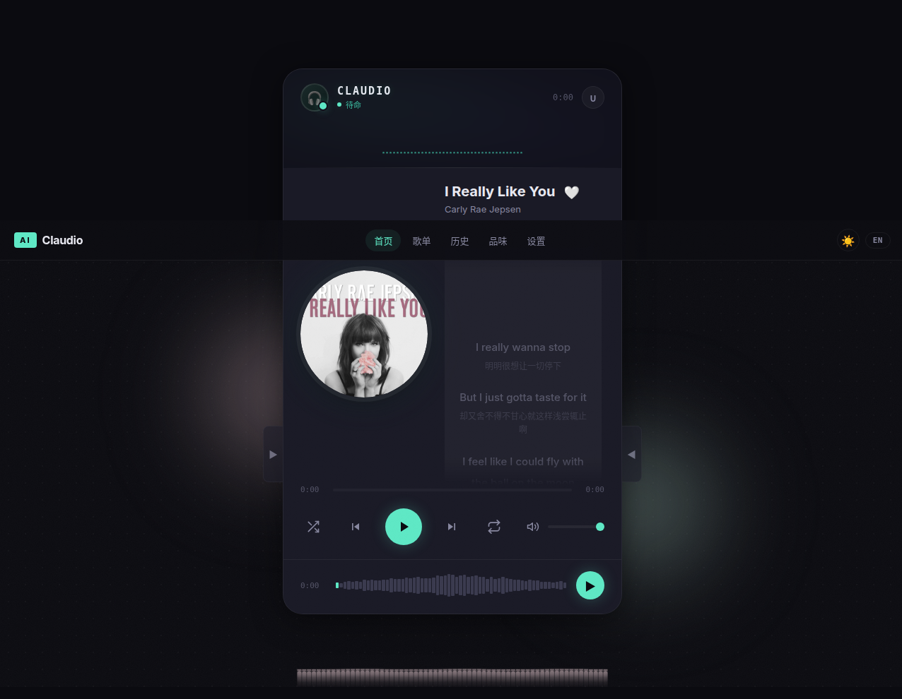
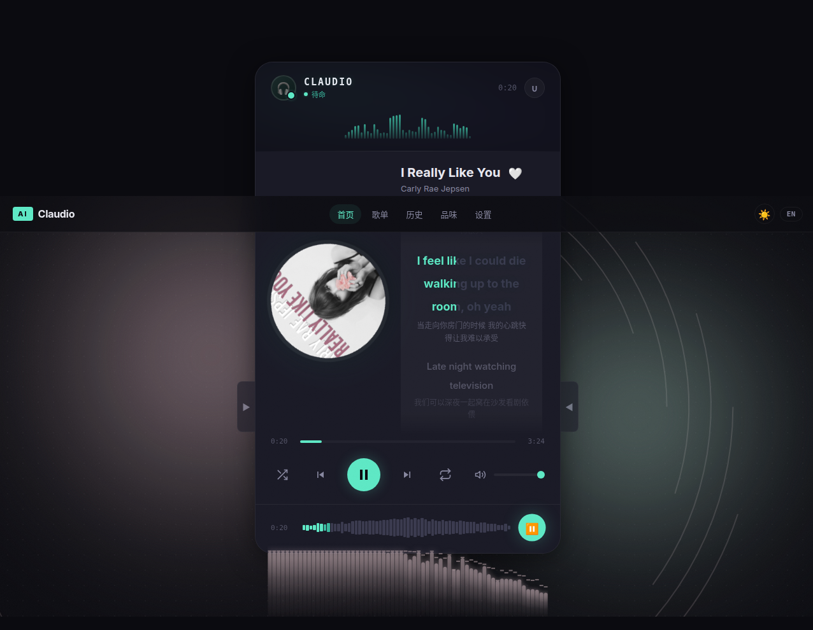
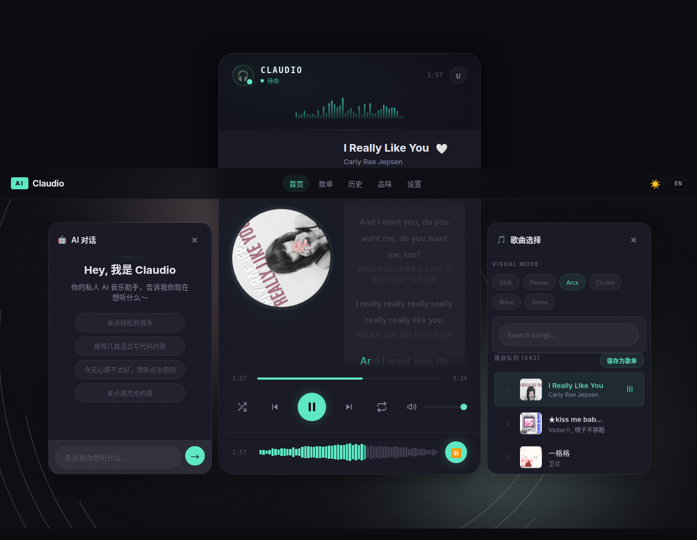
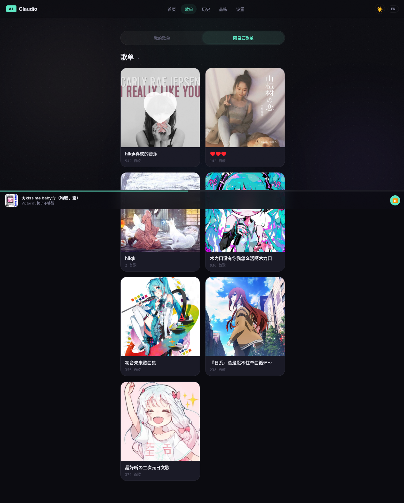
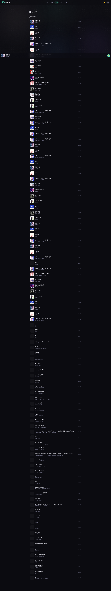
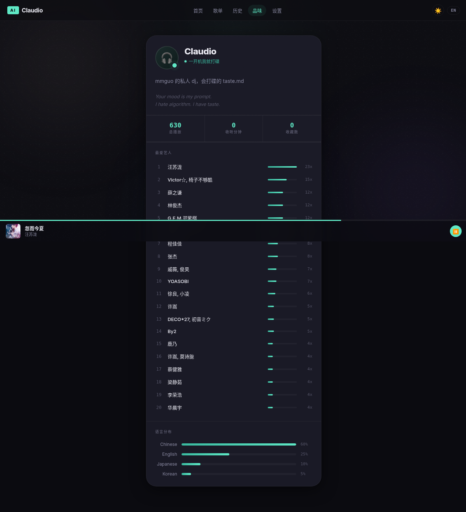
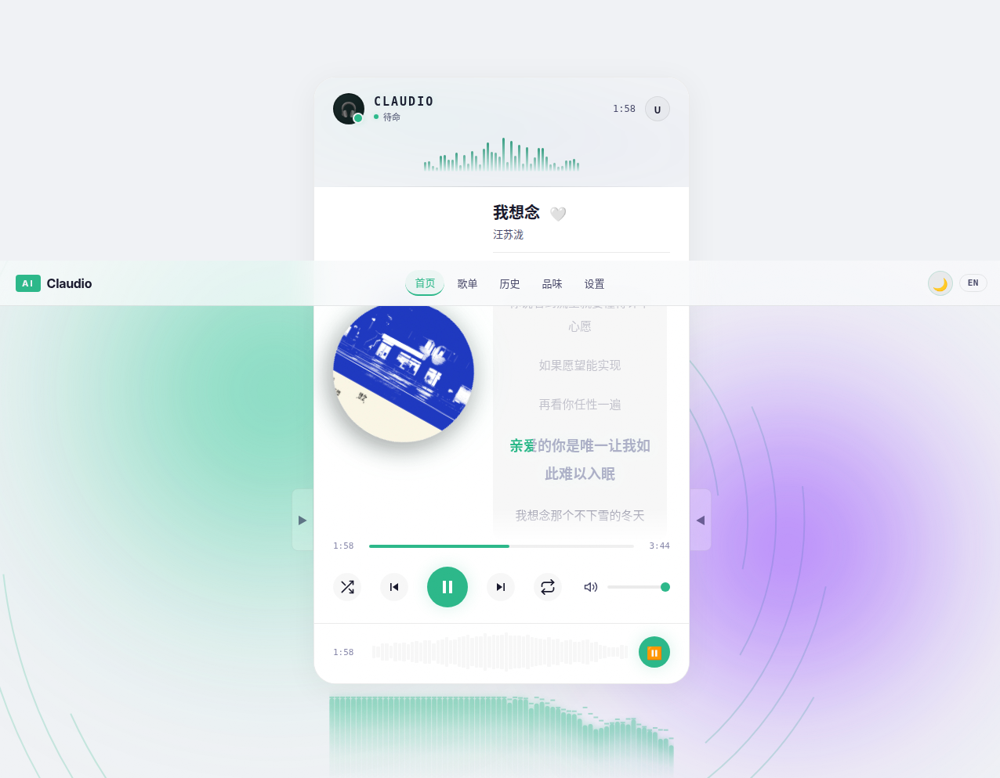
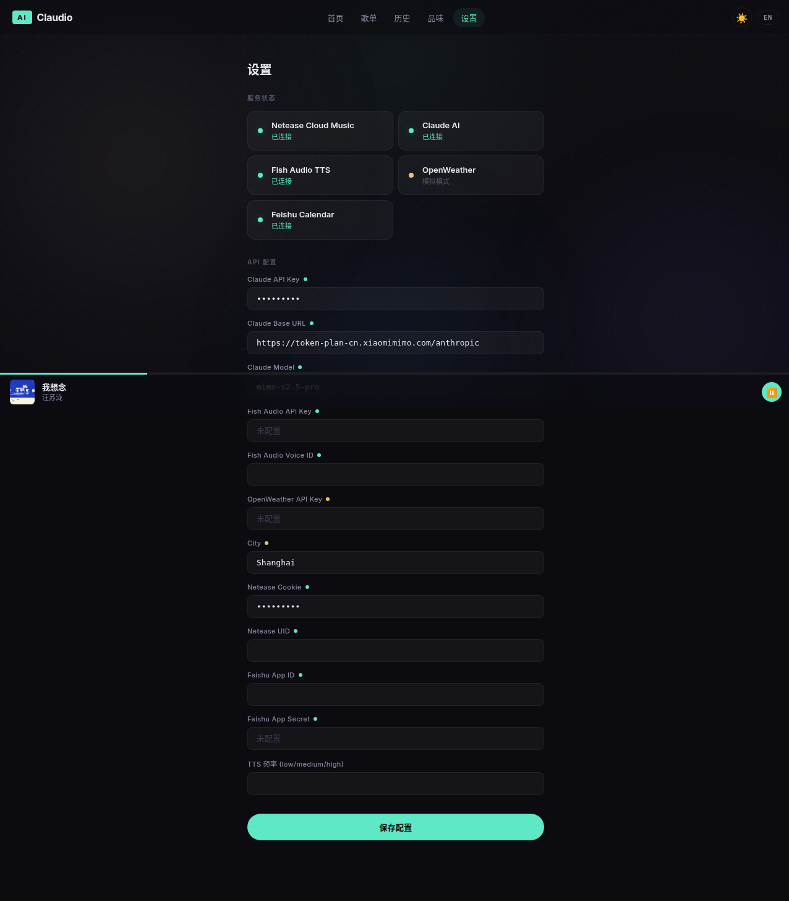
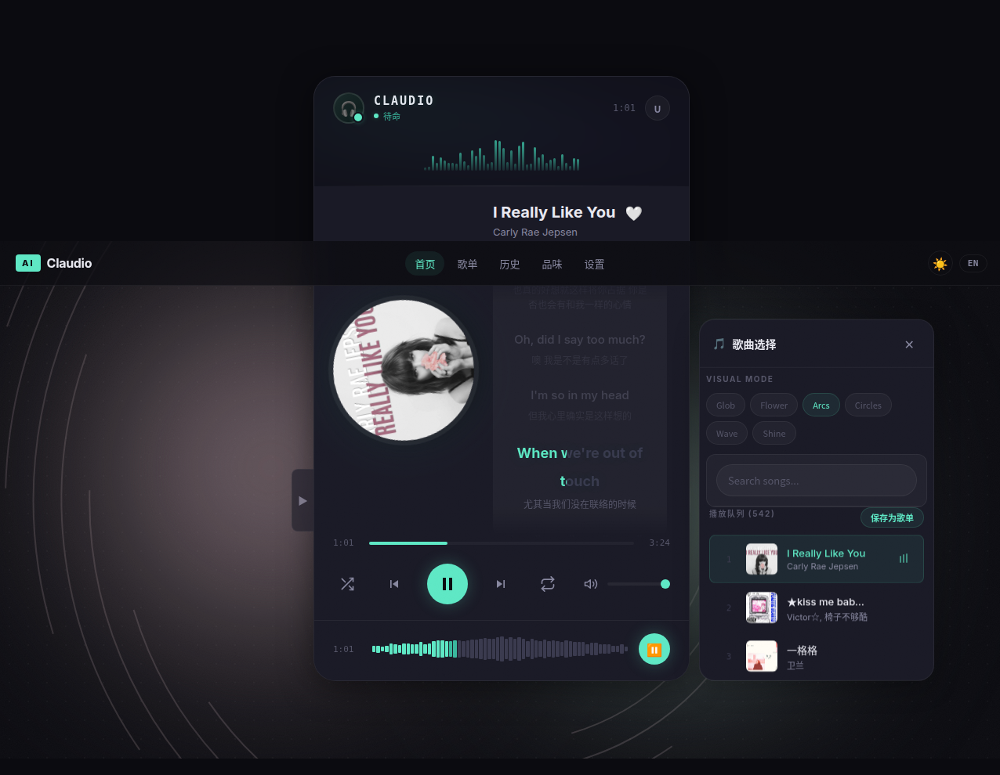

<div align="center">

# 🎵 Claudio — AI Music Radio

**你的私人 AI 音乐电台 · 看场景选歌 · 会说话的 DJ**

[](https://www.typescriptlang.org/)
[](https://react.dev/)
[](https://fastify.dev/)
[](https://pnpm.io/)
[](https://web.dev/progressive-web-apps/)
[](LICENSE)

把多年歌单蒸馏成一个会看场景、会说话、会选歌的个人 AI 电台。

Claudio 通过 Claude AI 根据你的口味、天气、时段和实时指令生成播放计划与 DJ 串词，再经 Fish Audio 合成语音播报，带来沉浸式电台体验。

</div>

---

## ✨ Features

| Feature | Description |
|:---|:---|
| 🤖 **AI DJ 串词** | Claude 自动生成主持词、天气提醒、音乐介绍，TTS 语音播报 |
| 🎯 **场景感知** | 结合天气、时段、日程动态调整音乐风格和推荐 |
| 💬 **自然语言点歌** | 输入「来点适合写代码的歌」即可调整播放风格 |
| 🎶 **网易云音乐** | 搜索、播放、逐字歌词、歌单管理、灰色歌曲解锁 |
| 🎨 **6 种音频可视化** | Glob / Flower / Arcs / Circles / Wave / Shine |
| 📊 **实时频谱分析** | 对数频率映射 + 感知低频增强 + 峰值指示器 |
| 🎤 **逐字歌词** | 网易云风格渐变扫描效果，rAF 驱动，零卡顿 |
| 🌙 **深色/浅色主题** | 一键切换，全面适配 |
| 📱 **PWA 支持** | 安装到桌面/手机，MediaSession 锁屏控制 |
| 🔒 **本地私有化** | 核心服务运行在本地，数据全部本地保存 |

---

## 📸 Screenshots

### 🎧 播放器 — 深色主题

<div align="center">

**待机状态 · 封面 + 歌词并排布局**



**播放状态 · Arcs 可视化 + 频谱条 + 逐字歌词渐变扫描**



</div>

### 🤖 AI 对话 + 歌曲选择

<div align="center">

**左侧 AI 对话侧边栏 · 中间播放器 · 右侧歌曲选择**



</div>

### 📋 其他页面

<div align="center">

| 歌单浏览 | 播放历史 | 个人品味 |
|:---:|:---:|:---:|
|  |  |  |

</div>

<div align="center">

| 浅色主题 | 设置页面 | 歌曲选择 |
|:---:|:---:|:---:|
|  |  |  |

</div>

---

## 🏗️ Architecture

```
┌─────────────────────────────────────────────────────────┐
│                    Frontend (React 19 + Vite)            │
│  ┌──────────┐  ┌──────────┐  ┌──────────┐  ┌─────────┐ │
│  │ Player   │  │ Playlist │  │ Profile  │  │Settings │ │
│  │ Page     │  │ Page     │  │ Page     │  │ Page    │ │
│  └────┬─────┘  └──────────┘  └──────────┘  └─────────┘ │
│       │    Zustand Store · WebSocket · AudioPlayer      │
│       │    KaraokeLyrics · AudioVisualizer · SpectrumBars│
└───────┼─────────────────────────────────────────────────┘
        │ HTTP + WebSocket
┌───────┴─────────────────────────────────────────────────┐
│                  Backend (Fastify + TypeScript)           │
│  ┌──────────┐  ┌──────────┐  ┌──────────┐  ┌─────────┐ │
│  │ Claude   │  │ NCM      │  │ Fish     │  │Weather  │ │
│  │ AI Plan  │  │ Music    │  │ Audio    │  │Service  │ │
│  └──────────┘  └──────────┘  └──────────┘  └─────────┘ │
│            SQLite (better-sqlite3) · TTS · Scheduler     │
└─────────────────────────────────────────────────────────┘
```

---

## 🚀 Quick Start

### Prerequisites

- **Node.js** >= 18
- **pnpm** >= 9
- **网易云音乐** 账号（Cookie）

### 安装 & 启动

```bash
# 克隆仓库
git clone https://github.com/hllqkb/Claudio.git
cd Claudio

# 安装依赖
pnpm install

# 配置环境变量
cp apps/server/.env.example apps/server/.env
# 编辑 .env，填入 API Key 等配置

# 一键启动 🎵
./start.sh
```

启动后访问:
- **前端**: http://localhost:5173
- **后端**: http://localhost:8080
- **NCM 代理**: http://localhost:3000

### 环境变量

| 变量 | 说明 | 必填 |
|:---|:---|:---:|
| `ANTHROPIC_API_KEY` | Claude AI API Key | ✅ |
| `ANTHROPIC_BASE_URL` | Claude API Base URL | ✅ |
| `FISH_AUDIO_API_KEY` | Fish Audio TTS API Key | ✅ |
| `FISH_AUDIO_VOICE_ID` | TTS 语音音色 ID | ✅ |
| `NETEASE_COOKIE` | 网易云音乐 Cookie | ✅ |
| `WEATHER_API_KEY` | OpenWeather API Key | ❌ |
| `CITY` | 天气城市（默认 Shanghai） | ❌ |

---

## 📁 Project Structure

```
Claudio/
├── apps/
│   ├── server/                    # Fastify 后端
│   │   ├── src/
│   │   │   ├── routes/            # API 路由
│   │   │   ├── services/          # 业务逻辑 (NCM, Claude, TTS, Weather)
│   │   │   ├── db/                # SQLite 数据仓库
│   │   │   ├── config.ts          # 配置管理
│   │   │   └── index.ts           # 入口
│   │   └── .env                   # 环境变量
│   └── web/                       # React 前端
│       ├── src/
│       │   ├── pages/             # 页面 (Player, Playlist, Profile, Settings, History)
│       │   ├── components/        # UI 组件
│       │   │   ├── KaraokeLyrics.tsx    # 逐字歌词（渐变扫描）
│       │   │   ├── AudioVisualizer.tsx  # 6种音频可视化
│       │   │   ├── SpectrumBars.tsx     # 实时频谱分析
│       │   │   ├── ParticleCanvas.tsx   # 粒子特效
│       │   │   ├── ChatArea.tsx         # AI 对话
│       │   │   └── ...
│       │   ├── stores/            # Zustand 状态管理
│       │   ├── audio/             # AudioPlayer 引擎
│       │   ├── api/               # API 客户端 + WebSocket
│       │   ├── i18n/              # 国际化 (中/英)
│       │   └── styles/            # 全局 CSS
│       └── vite.config.ts
├── start.sh                       # 一键启动脚本
├── CLAUDE.md                      # Claude Code 项目规范
└── pnpm-workspace.yaml
```

---

## 🎨 Design System

| Token | Dark | Light |
|:---|:---|:---|
| Primary | `#5ee8c5` | `#0d9488` |
| Background | `#0a0a0f` | `#f8f9fa` |
| Card | `rgba(255,255,255,0.04)` | `rgba(0,0,0,0.02)` |
| Text Primary | `#e2e8f0` | `#1a1a2e` |
| Text Secondary | `#94a3b8` | `#64748b` |
| Border | `rgba(255,255,255,0.06)` | `rgba(0,0,0,0.08)` |

---

## 🛠️ Tech Stack

| Layer | Technology |
|:---|:---|
| **Frontend** | React 19 · Vite · Zustand · PWA · TypeScript |
| **Backend** | Fastify · WebSocket · TypeScript |
| **Database** | SQLite (better-sqlite3) |
| **AI** | Anthropic Claude API |
| **Music** | 网易云音乐 + UnblockNeteaseMusic |
| **TTS** | Fish Audio / Edge TTS |
| **Package** | pnpm workspace (monorepo) |

---

## 📖 Key Concepts

### 🎤 Karaoke Lyrics
逐字歌词使用 `background-clip: text` + CSS `--progress` 变量实现网易云风格渐变扫描效果。rAF 驱动的直接 DOM 更新确保零 React 重渲染，丝滑不卡顿。

### 📊 Spectrum Bars
实时频谱分析采用对数频率映射（perceptually correct），感知低频增强算法补偿人耳低频灵敏度差异，快速上升 (attack 0.5) + 缓慢下降 (release 0.88) 的平滑策略。

### 🤖 AI Planning
Claude AI 根据当前场景（天气/时段/用户偏好）生成播放计划，自动插入 DJ 串词，通过 Fish Audio 合成自然语音播报。

---

## 🤝 Contributing

```bash
# 开发模式启动
pnpm dev

# 构建
pnpm --filter @ai-radio/web build
pnpm --filter @ai-radio/server build

# 代码规范
# - TypeScript strict mode
# - 4-space indent
# - Conventional Commits (feat:, fix:, docs:, chore:)
```

---

## 📄 License

MIT © [hllqkb](https://github.com/hllqkb)

---

<div align="center">

**Made with ❤️ and AI**

[GitHub](https://github.com/hllqkb/Claudio) · [Report Bug](https://github.com/hllqkb/Claudio/issues) · [Request Feature](https://github.com/hllqkb/Claudio/issues)

</div>
